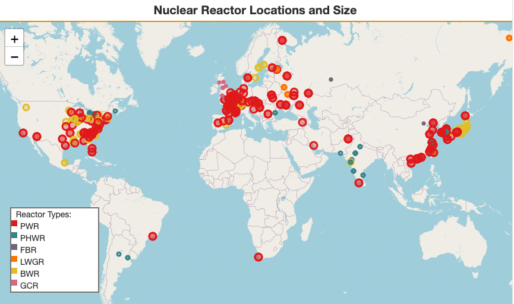
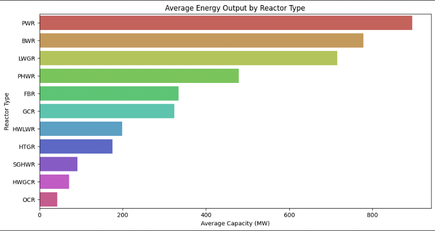
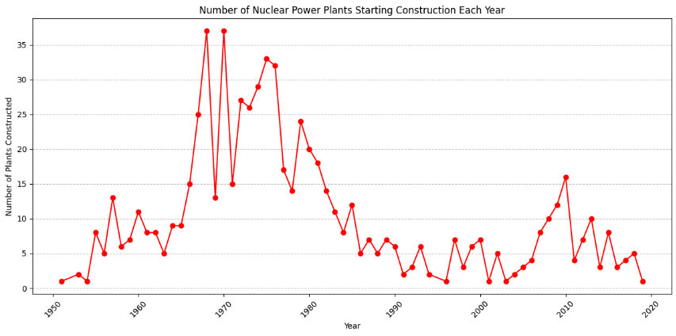

# Nuclear Power Plant Visualization

## Introduction

This project aims to visualize the global distribution of nuclear power plants, focusing on their capacity, type, and operational status. Using data analysis and interactive mapping techniques, this project provides insights into the nuclear energy landscape, highlighting the capacity and types of reactors in operation around the world.

## Features

- Interactive map visualization of nuclear power plants.
- Circle markers representing the capacity of each plant.
- Color coding for different types of reactors.
- Filtering to display only active power plants.
- Custom legend for reactor types.

- Reactor type average capacity

- Nuclear Power Plants Starting Construction Per Year

## Data Source

The data used in this project is sourced from https://www.kaggle.com/code/jonathanbouchet/nuclear-power-plant-geo-data/input?select=data . It contains detailed information about nuclear power plants, including their location (latitude and longitude), operational status, reactor type, capacity, and other relevant details.

## Dependencies

This project is built using Python and the following libraries:

- Folium for map visualization
- Pandas for data manipulation
- Branca for custom color scaling